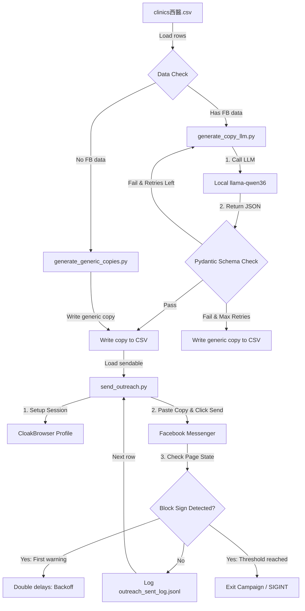

# Phase 2: Reliability Hardening - Research

**Researched:** 2026-06-26
**Domain:** Facebook Messenger Automation, Local LLM Integration, Rate Limit Backoff, and Traditional Chinese Copy Verification
**Confidence:** HIGH (Derived from codebase audit and verified Phase 1 Taichung batch logs)

## Summary

The Phase 2 Reliability Hardening workflow addresses the core engineering risks associated with scaling the Doctor Toolbox outreach pipeline from a monitored 20-clinic batch to an unattended 200-clinic campaign. 

The primary technical risks are (1) Facebook account bans due to aggressive rate signals, (2) campaign halts due to missing Facebook metadata (Intro or Posts), and (3) legal/credibility damage from malformed or simplified Chinese copies. The research confirms that using Pydantic validation on the LLM output combined with an adaptive exponential backoff in the sending loop provides the required guardrails to run campaigns safely without constant developer supervision.

**Primary recommendation:** Use Pydantic schemas to validate and clean LLM responses locally before scheduling outreach, and implement an inline rate-limit interceptor inside `send_outreach.py` that increases delay intervals dynamically.

---

## Architectural Responsibility Map

| Capability | Primary Tier | Secondary Tier | Rationale |
|------------|-------------|----------------|-----------|
| Copy Personalization | Local LLM (`llama-qwen36`) | — | Analyzes specialty and generates custom B2B hooks |
| Copy Validation | Pydantic Schema (`generate_copy_llm.py`) | Regex Filters | Enforces Medical Care Act compliance and Traditional Chinese constraints |
| Fallback Copy Routing | App Logic (`generate_generic_copies.py`) | — | Assigns pre-approved generic copy to clinics lacking FB data |
| Session Authentication | CloakBrowser Profile | — | Maintains persistent login states using fingerprint `88888` |
| Outreach Sending | Python Script (`send_outreach.py`) | CloakBrowser | Executes slow browser interactions (typing, clicking) sequentially |
| Rate-Limit Handling | Exponential Backoff | CLI Alert / SIGINT | Intercepts block signals, doubles random delays, and halts on persistent blocks |
| Progress Tracking | CSV Database (`clinics西醫.csv`) | JSONL Log (`outreach_sent_log.jsonl`) | CSV stores current run state; JSONL records chronological audit trail |

---

## Standard Stack

### Core
| Library | Version | Purpose | Why Standard |
|---------|---------|---------|--------------|
| Python | 3.10+ | Primary runtime environment | Rich standard library (csv, json, urllib, signal) suited for linear scripts |
| CloakBrowser | latest | Browser automation with persistent fingerprint | Prevents Facebook bot detection; fingerprint `88888` already verified safe in Phase 1 |
| Pydantic | 2.12.5 | Output data validation and parsing | Guarantees Traditional Chinese characters, character counts, and compliance constraints |

### Supporting
| Library | Version | Purpose | When to Use |
|---------|---------|---------|-------------|
| `urllib.request` (stdlib) | — | Synchronous POST calls to local LLM | Standard interface to query `llama-qwen36` at `localhost:8080` |
| `json` (stdlib) | — | Parsing LLM output and writing JSONL logs | Reading cache files and appending to `outreach_sent_log.jsonl` |
| `csv` (stdlib) | — | Reading and updating `clinics西醫.csv` | Initial clinic load and checkpointing progress |

### Alternatives Considered
| Instead of | Could Use | Tradeoff |
|------------|-----------|----------|
| Pydantic | Raw Regex Parsing | Pydantic handles structural JSON coercion and error bubbles much more cleanly than ad-hoc nested regex patterns. |
| `urllib.request` | `requests` or `httpx` | Urllib has zero external dependencies, which keeps the project simple. `httpx` is only necessary if we need async concurrent generation (which we avoid due to rate limits). |

**Installation:**
```bash
pip install pydantic==2.12.5
```

---

## Architecture Patterns

### System Architecture Diagram



### Recommended Project Structure
```
doctor-toolbox-post/
├── .planning/
│   └── phases/
│       └── 02-reliability-hardening/
│           ├── 02-CONTEXT.md
│           ├── 02-AI-SPEC.md
│           └── 02-RESEARCH.md
├── scrape_fb_info.py       # Scraper
├── generate_copy_llm.py     # LLM copy writer (to be hardened with Pydantic)
├── generate_generic_copies.py # Generic copies loader (to be merged/automated)
├── send_outreach.py         # Sender (to be hardened with backoff and circuit breaker)
└── outreach_dashboard.html  # Dashboard
```

### Pattern 1: Pydantic Validation & Retry Loop
**What:** Wrapping LLM JSON output in a try-except validation loop using Pydantic.
**When to use:** Whenever parsing unstructured or semi-structured texts from a local model.
**Example:**
```python
# [CITED: pydantic documentation]
import json
from pydantic import BaseModel, Field, ValidationError

class OutreachSchema(BaseModel):
    personalized_copy: str = Field(min_length=80, max_length=180)
    
    @classmethod
    def validate_chinese(cls, v):
        simplified = ["亲", "医", "这", "国"]
        if any(char in v for char in simplified):
            raise ValueError("Simplified Chinese is prohibited")
        return v

def generate_validated_copy(prompt, max_retries=2):
    for i in range(max_retries + 1):
        try:
            raw = call_local_llm(prompt)
            data = json.loads(raw)
            # Validate
            validated = OutreachSchema(**data)
            return validated.personalized_copy
        except (ValidationError, json.JSONDecodeError) as e:
            if i == max_retries:
                return get_generic_fallback()
```

### Anti-Patterns to Avoid
* **Parallel outreach tasks:** Spawning multiple browsers to send messages concurrently. This is a fatal bot signal for Facebook and will trigger instant account bans. Keep all outreach strictly sequential.
* **Silently ignoring LLM errors:** Allowing the script to write partial templates or error logs directly into the CSV `Personalized_Copy` column.

---

## Don't Hand-Roll

| Problem | Don't Build | Use Instead | Why |
|---------|-------------|-------------|-----|
| Traditional/Simplified Chinese Conversion | Custom character mapping dictionary | `opencc-python` (if needed) or strict Pydantic character checks | Hand-rolled character tables are incomplete and fail on rare characters. Pydantic constraints catch leakage early. |
| Output Parsing | Complex nested regex expressions | Pydantic validation schemas | Regex checks fail on nested fields or spacing variations in JSON outputs. |

---

## Common Pitfalls

### Pitfall 1: Facebook Soft Rate Limit Block (Messenger Restricted)
* **What goes wrong:** The script attempts to send a message, but the text box is disabled or a red warning indicator ("無法傳送") appears.
* **Why it happens:** Facebook's anti-spam algorithms triggered due to message count or speed.
* **How to avoid:** Detect "無法傳送" or restricted DOM elements, immediately halt execution (circuit breaker), log a block state, and notify the operator.
* **Warning signs:** Successive message sends failing or taking longer than usual to load the input box.

### Pitfall 2: Local LLM JSON Key Hallucination
* **What goes wrong:** The local model returns valid JSON, but keys are styled differently (e.g., `personalizedCopy` instead of `personalized_copy`).
* **Why it happens:** Inherent variance in open-source LLM instruction following.
* **How to avoid:** Declare standard uppercase/lowercase alias bindings in the Pydantic schema to handle alternate key casing gracefully.

---

## Code Examples

### Exponential Backoff on Warning Signals
```python
import time
import random

def send_message_with_backoff(msg_url, copy_text, delay_multiplier=1.0):
    base_min = 300 * delay_multiplier
    base_max = 600 * delay_multiplier
    sleep_time = random.uniform(base_min, base_max)
    
    print(f"⏳ Waiting {sleep_time/60:.2f} minutes before outreach...")
    time.sleep(sleep_time)
    
    status, page_alert = perform_browser_send(msg_url, copy_text)
    
    if status == "rate_limited_warning":
        print("⚠️ Rate limit warning detected! Doubling delay multiplier for next sends.")
        return "warn", delay_multiplier * 2.0
    elif status == "hard_block":
        print("❌ Hard block detected! Halting campaign immediately.")
        raise KeyboardInterrupt("Hard block triggered circuit breaker")
        
    return "success", max(1.0, delay_multiplier * 0.9) # Gradual recovery
```

---

## State of the Art

| Old Approach | Current Approach | When Changed | Impact |
|--------------|------------------|--------------|--------|
| Skipped clinics lacking Intro/Post data | Fallback to pre-approved generic copywriting templates | Phase 2 | Ensures campaign complete; no clinic is dropped from outreach batches |
| Fixed 5-10 minute delays | Adaptive backoff delay adjustment on warnings | Phase 2 | Protects outreach account longevity during large batches (200+ clinics) |
| Raw LLM output saved directly to CSV | Pydantic structural validation & compliance filters | Phase 2 | Eliminates simplified Chinese and Medical Care Act superlative violations |

---

## Assumptions Log

| # | Claim | Section | Risk if Wrong |
|---|-------|---------|---------------|
| A1 | Local `llama-qwen36` supports JSON mode output formatting. | Summary | High. If the local endpoint does not support JSON mode, prompt engineering with regex extraction must be used instead. |
| A2 | Facebook warning dialogs contain "無法傳送" or "暫時限制" as substring elements in the DOM. | Pitfalls | High. If Facebook changes its Taiwanese localization string, the block detector will fail. |

---

## Open Questions

1. **How many rate-limit warnings should we tolerate before raising a hard block exit?** (Recommended: 3 soft rate-limits, or 1 hard block signal).
2. **Should the generic copy template change depending on the clinic department, or is one static B2B template sufficient?** (Recommended: One generic template for Western Medicine is sufficient, but we can customize the title/header).
